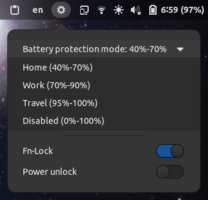

# Huawei WMI controls (GNOME extension)

### Control various Huawei and Honor laptops WMI functions, such as battery protection, Fn-lock, power unlock and keyboard backlight.

Relies on [aymanbagabas/Huawei-WMI](https://github.com/aymanbagabas/Huawei-WMI) kernel module _(use [feat/kbdlight](https://github.com/aymanbagabas/Huawei-WMI/tree/feat/kbdlight) branch to enable power unlock feature)_ along with [qu1x/huawei-wmi](https://github.com/qu1x/huawei-wmi) to use the WMI interface.
